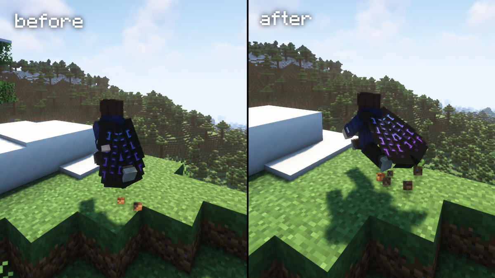

# Elytra Physics

This is a just simple Minecraft mod that adds cape-like physics to the elytra when it are worn by the player.

No longer will the elytra look awkward and stiff on your back when running around wearing it.

## Download

https://www.curseforge.com/minecraft/mc-mods/elytra-physics

## Compatibility

As of version 2.0, the mod now supports adding custom compatibility with layer renderers from other mods.

If another mod has an elytra that doesn't work with Elytra Physics, open the config file ('elytra_physics-client.toml' for Forge, 'elytra-physics-config.json' for Fabric) and add the classpath of the layer renderer for the custom elytra to the 'inject_layers' list.

### How do I find the classpath?

The classpath of a class is the package path to that class (found at the top of the .java file for the layer, 'package {classpath}') + the name of the class.

Some of the requested mod compatibilities are already included in the config.